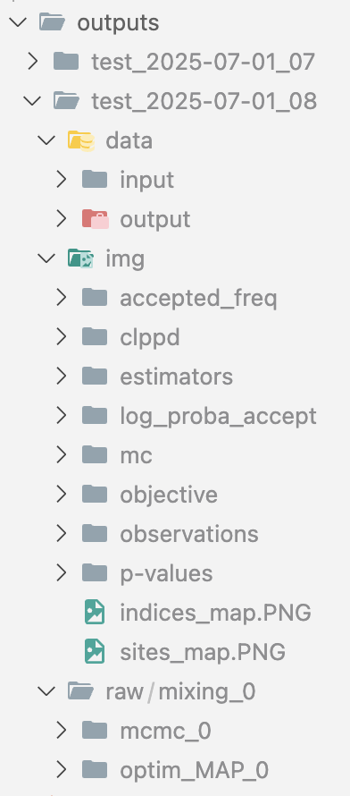
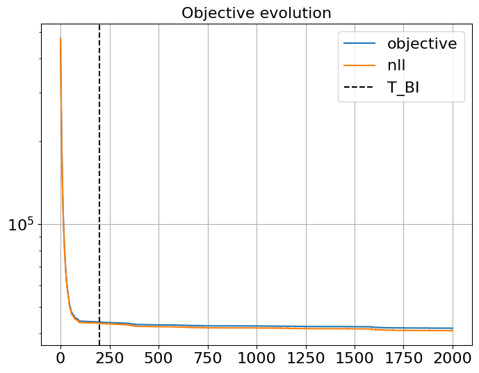
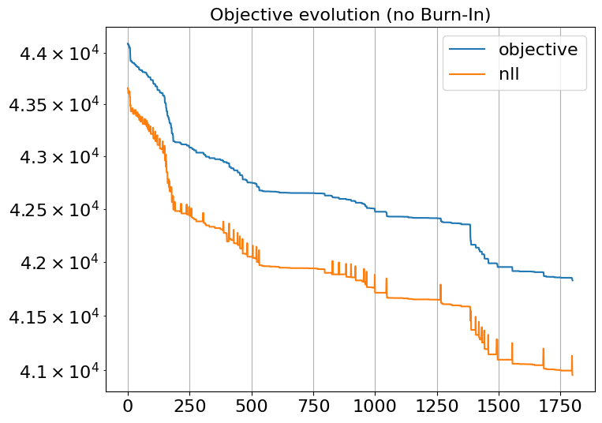

# beetroots-tuto

This repository provides an example of the end-to-end pipeline combining [beetroots](https://github.com/pierrePalud/beetroots) and [nnbma](https://github.com/einigl/ism-model-nn-approximation).
This pipeline can analyze telescope observations with an astrophysical model.

The goal here is to make sure everything works with mock data. Once it runs, replace the mock data with your own, sit back and let `beetroots` extract the most out of it!

In a nutshell, the pipeline consists of two steps:

1) use `nnbma` to derive a neural network approx of a physical simulator
2) use `beetroots` to perform physical parameters inference from a multispectral observation

Then, there is a 3rd step for the user: the results analysis!

To learn more about nnbma and beetroots, check the associated papers, published in Astronomy & Astrophysics:
* nnbma: https://www.aanda.org/articles/aa/abs/2023/10/aa47074-23/aa47074-23.html
* beetroots: https://www.aanda.org/articles/aa/abs/2025/06/aa54266-25/aa54266-25.html

## Step 0: install

### First approach: simple and quick

In a virtual environment, run

```shell
pip install beetroots
```

This will automatically install `nnbma` as well.

### Second approach: if the first does not work due to version conflict

The following steps are designed for someone using `Visual Studio Code` (`vscode` in short). It resorts to `Docker` to avoid version conflict.

1) Install [Docker Desktop](https://www.docker.com/get-started/) (choose the version adapted to your OS) (optional step, yet useful to make sure you use the correct versions)

2) Then open a terminal wherever you want to install this tutorial, and run

```shell
git clone https://github.com/pierrePalud/beetroots-tuto.git
cd beetroots-tuto
docker build -t beetroots-tuto .
```

3) Then open `vscode`, click on the button at the extreme bottom left corner (see image below), and select "Reopen in container".


## Step 1: nnbma to derive a neural network approx of a physical simulator

Play with the `notebooks/01_learn_emulator.ipynb` notebook.

The goal is to obtain a neural network with an error on the test set that is small, ideally negligible, compared to the observation multiplicative uncertainties (typically, calibration error).

The trained neural network will be saved in the `./data/models` folder, with the name you will provide.

## Step 2: beetroots to perform physical parameters inference

Once the mode is trained and saved, to run beetroots, there is only one command to run!

* If you installed beetroots using the `pip` command, simply run:

```shell
python beetroots_tuto/synthetic_case_nn.py input.yaml ./data/synthetic_case ./data/models .
```

* If you installed beetroots using Docker and the steps above, run:

```shell
poetry run python beetroots_tuto/synthetic_case_nn.py input.yaml ./data/synthetic_case ./data/models .
```

This command contains **5 arguments**, that can be changed for your own use cases:

* `beetroots_tuto/synthetic_case_nn.py` : the python file to run. This one is a good default one.
* `input.yaml` : the name of the `.yaml` file that contains all the set up parameters of your inference process.
* `./data/synthetic_case` : the path to the folder that contains the `.yaml` file and all the data required for the run (including the observation files).
* `./data/models` : the path to the folder that contains all the trained neural networks
* `.` : the path where the `outputs` folder, that contains all the results produced by `beetroots`, will be saved.

To change some parameters of the reconstruction, modify the `data/synthetic_case/input.yaml` file.

**AND THIS IS IT, CONGRATULATIONS, YOU MADE BEETROOTS RUN!**

Now what remains is to analyze the results.
But fear not: `beetroots` automatically performs an exhaustive results analysis.
Let's now explore the output of this analysis.


---
---


## Analyzing the results of an inference run

Whether in optimization (`optim_map`) or sampling (`mcmc`) mode, `beetroots` always creates an output folder with the same structure:



The name of each output folder is generated from
* the simulation name (defined in the `input.yaml` file, in the `simu_name` entry). Here it is set to "test".
* the date and hour (here the 1st of July of 2025, at 8AM).

Each output folder contains 3 subfolders:
* `data`: it contains tabular data (typically csv files). It contains 2 subfolders:
  * input: input data to the inference, for traceability
  * output: contains some of the values used to plot the figures in "img"

* `raw`: it contains the raw data, available in case the beetroots's automatic results extraction does not run a test you want, or in case you want to re-do one of the figures.

* `img`: the main output folder, that should be analyzed when the inference run is finished. In this folder, mainly 4 subfolders are interesting for standard users:
  * `observations`: shows the observations actually used for inversion. Usefull to check whether beetroots analyzes the data you think it is analyzing.
  * `objective`: shows how the negative log posterior evolves with the number of iterations. Essential to assess convergence for both optimization and MCMC.
  * `accept_freq`: shows the evolution of the frequency at which a candidate is accepted for both PMALA (local exploration) and MTM (global exploration).
  * `estimators`: shows the reconstructions and uncertainty quantifications (for MCMC)
  * `p-values`: results of the model checking / posterior predictive checking test, that assesses how well the reconstructions can reproduce the observations.


**Now, what to do from these outputs? What actions to take?**

First, check the `estimators` (ie, the reconstructions).
Second, whether the reconstructions make sense to you or not, perform a few sanity checks:
* check convergence (`objective`)
* check the efficiency of the local and global explorations (`accept_freq`)
* check whether your reconstructions reproduces your observations (`p-values`)


### Case 1: in optimization mode

The inference process runs an optimization when the `to_run_optim_map` entry in the `input.yaml` file set to `true`.
If you do not want to run an optimization process, set this parameter to `false`.

#### check convergence

in `objective`: look at the two files
* `optim_map_objective_with_bi.PNG`
* `optim_map_objective_no_bi.PNG`

(bi= Burn-In. These are the first steps to be disregarded in `no_bi` figures. The number of steps to disregard is set in the `input.yaml` file, in the `run_params/map/T_BI` entry).

For instance:



(in the legend, "nll" stands for "negative log likelihood". It is one of the elements of the negative log posterior, here called "objective". The function being minimized is the "objective".)

As the objective very quickly decreases during the first iterations, it is hard to assess whether the optimization converged.
When the Burn-In is removed, the convergence is easier to assess:



In this case, it seams that the convergence has not been reached.

To improve convergence, there are two options:
* increase the total number of iterations (set in the `input.yaml` file, in the `run_params/map/T_MC` entry).
* improve the local and global explorations.

This second approach requires diagnosing the efficiency of the two exploration approaches.

#### check the efficiency of local and global exploration

in `accepted_freq/optim_map`: look at the two files
* `freq_accept_seed0_MTM.PNG` for global exploration
* `freq_accept_seed0_PMALA.PNG` for local exploration


In optimization mode, candidates are only accepted if they lead to a decrease of the objective.
If convergence is reached, then candidates are no longer accepted.
Therefore, **the accept frequency should go to zero for both exploration approaches**.

However, they should go to zero at similar speed.
* if the local exploration goes to 0 much earlier than global exploration, then its step size should be decreased (in the `input.yaml` file, entry `sampling_params/map/initial_step_size`)
* if the global exploration goes to 0 much earlier than local exploration, then the number of candidates generated at each global exploration step should be increased (in the `input.yaml` file, entry `sampling_params/map/k_mtm`)

### Case 2: in sampling mode

The inference process runs sampling when the `to_run_mcmc` entry in the `input.yaml` file set to `true`. If you do not want to run an MCMC process, set this parameter to `false`.

#### check convergence

in `objective`: look at the two files
* `mcmc_objective_with_bi.PNG`
* `mcmc_objective_no_bi.PNG`

In MCMC, convergence is reached when the "objective" (negative log posterior) has no trend after the Burn-in phase, that is, has a noisy shape around a constant value.

The Burn-In phase size (`run_params/mcmc/T_BI`) should be set so that any decreasing trend in the objective is captured in the Burn-In phase.

Then, the larger the total number of iterations (`run_params/mcmc/T_MC`), the better the reconstructions and the uncertainty quantifications.

#### check the efficiency of local and global exploration

in `accepted_freq/mcmc`: look at the two files

* `freq_accept_seed0_PMALA.PNG` for local exploration. After the Burn-in phase, the ideal accept frequency is around 60% (with a margin of around $\pm 20$%). If the achieved accept frequency is above 60% (you accept too often), increase the step size (`sampling_params/mcmc/initial_step_size`). If it is below 60% (you reject too often), decrease it.

* `freq_accept_seed0_MTM.PNG` for global exploration. Here, the higher the better, but the accept frequency should be at least 5%. If you are below (you reject too much), increase the number of generated candidates (in the `input.yaml` file, entry `sampling_params/mcmc/k_mtm`)

#### model check: Posterior predictive check

in `p-values/mcmc`: look at the `decision_pval_estim_optim_map_seed0.PNG` file.

This file shows the pixels that are well reproduced and those that are not.

If most pixels are not well reproduced, you might underestimate the uncertainties on your observations or on your model.
For more information on this topic, check the [beetroots A&A paper](https://www.aanda.org/articles/aa/abs/2025/06/aa54266-25/aa54266-25.html).
